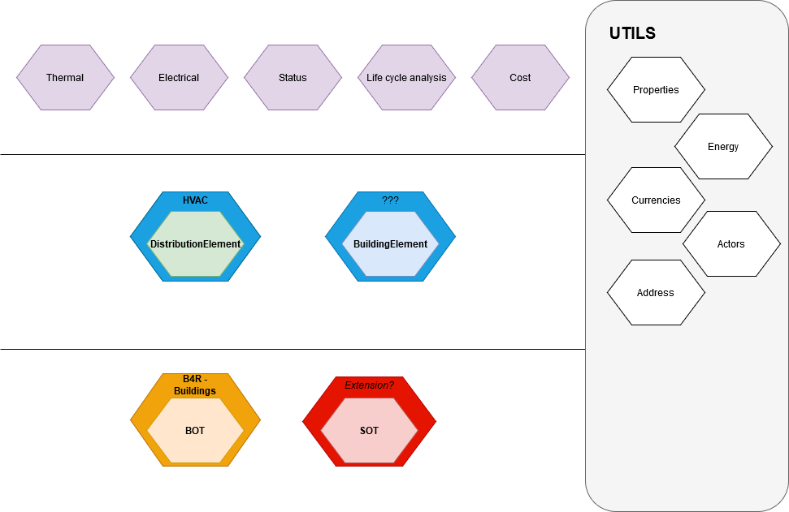

## BIM4Ren ontology
The BIM4Ren ontology is used as a BIM model for energy performance renovation of residential buildings. The approach used resides in reusing or creating different ontologies that can all be gathered to form a BIM model used to describe both the building before and after renovation.

The design pattern resides in a full modular approaches, each ontology being a module of the overall model. Each ontology must be categorized in 1 of the 4 following laters:

### Utils

Ontologies in the Utils layers are made of generic concepts that can be used in the 3 others layers. The concepts must therefore be as generic as possible.\
The main ontologies are made of:
- the QUDT ontology: which gathers information on quantities and units;
- the basics semantics ontologies: which provides a pattern for describing properties according to the CEN SMSL working group, so as to encapsulate quantity kinds, units, values and uncertainty
- the property ontology that contains generic properties describes according to the CEN SMLS work; the properties modelled are not specific to the AEC industry.

Additional ontologies are used to model building actors, energy-related concepts or addresses.

### The Core Layer

It contains ontologies that are used to gather building components according to specific usage and properties:
- The BOT ontology is used to describe the building topology and is used to localize building components inside a building. This ontology was extended in the buildings ontology to add concepts such as enveloppe description or the buildings/rooms usages.
- The SOT ontology is used to describe networks inside a building (water systems, heating, cooling or ventilating systems, even digital networks).
- The intervention ontology is used to model past interventions on the building and elements impacted.

### The Product layer

The product layer is made of taxonomies extracted from the IFC4 standard, to categorize building products.
- the distributionelement ontology contains a type hierarchy for HVAC systems and monitoring devices.
- the buildingelement ontology contains a type hierarchy for building products.
- the domesticappliance ontology contains a type hierarchy for domestic appliances.

Each of this taxonomies was extended, potentially into ontologies, adding properties that are specific to some of the concepts described.

### The Domain layer

The domain layer contains ontologies for each specific domain. They can be associated to Property sets in the IFC standard. The different domains identified are:
- thermal: to model thermal properties of the different building assets.
- electrical: to model properties of electrical components.
- manufacturer properties
- fluid-related properties.